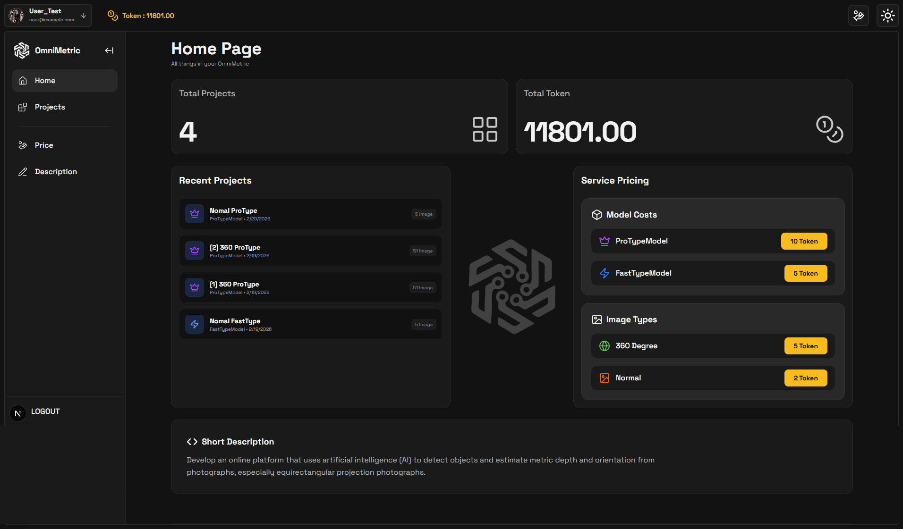
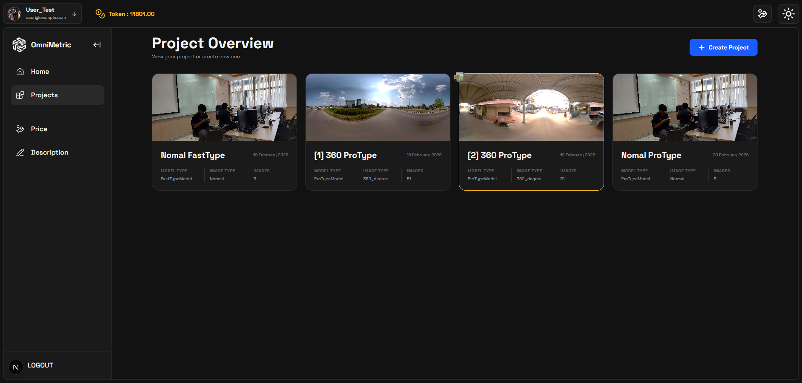
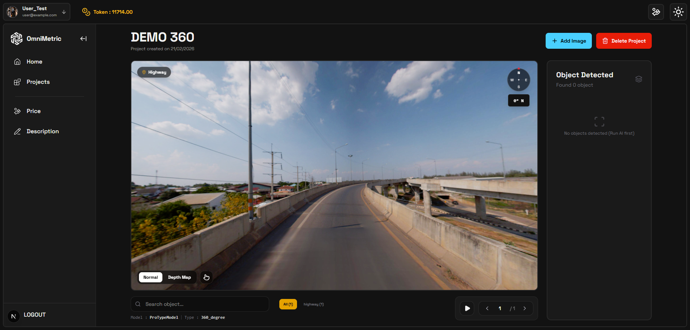

# 🎯 OmniMetric: AI-Powered Spatial Distance Estimation

OmniMetric is a web-based AI platform that transforms standard 2D images and 360° panoramas into intelligent measuring tools. By leveraging state-of-the-art Computer Vision models, it estimates metric depth and distances without the need for expensive hardware like LiDAR scanners (Cost Democratization).

## ✨ Key Features

* **360° Panorama Support:** Fully interactive 3D viewer for equirectangular images.
* **Intelligent Object Detection:** Automatically detects objects (e.g., cars, people, trucks) in the scene.
* **Metric Depth Estimation:** Calculates the real-world distance (in meters) to detected objects.
* **The "Sniper Method" Pipeline:** A custom architectural approach that isolates, crops, and flattens distorted 360° regions before running depth estimation for high-accuracy results.
* **Token-Based System:** Built-in monetization system with Stripe integration for commercial SaaS scalability.

## 🛠️ Tech Stack

| Component | Technology |
| :--- | :--- |
| **Frontend** | Next.js, Tailwind CSS, Three.js |
| **Backend** | FastAPI (Python) |
| **AI / ML** | PyTorch, YOLO11, Depth Pro, Depth Anything V2, Py360Convert |
| **Database & Storage** | PostgreSQL, MinIO |
| **Infrastructure** | Docker, Docker Compose |
| **Payment** | Stripe API |

## 🧠 The AI Pipeline (Sniper Method)

For 360° panoramas, standard depth models suffer from distortion. OmniMetric solves this using a multi-stage approach:
1. **The Scout:** YOLO detects objects in the raw, distorted equirectangular image.
2. **The Sniper Scope:** Calculates the Yaw/Pitch of the object and uses `Py360Convert` to extract a flattened, distortion-free perspective crop.
3. **The Rangefinder:** Passes the clean crop to Depth Models (Depth Pro / Depth Anything V2) to extract the median metric distance with high precision.

## 📁 Model Directory Structure

Ensure the pre-trained AI models are placed in the `backend/checkpoint/` directory before running. The backend will verify these files on startup.

```text
backend/
├─ checkpoint/
│  ├─ depth_anything_v2/
│  │  ├─ depth_anything_v2_vitb.pth
│  ├─ depth_pro/
│  │  ├─ depth_pro.pt
│  ├─ yolo/
│  │  ├─ yolo11n.pt
│  ├─ categories_places365.txt
│  ├─ resnet50_places365.pth.tar
```

## 🚀 Getting Started

### 1. Prerequisites
* [Docker](https://www.docker.com/) and Docker Compose installed on your machine.

### 2. Environment Variables
Create two `.env` files in your project directory.

**Backend (`backend/.env`)**
```env
FRONTEND_URL=http://localhost:3000
DATABASE_URL=postgresql://user:password@db:5432/omnimetric
S3_ENDPOINT_URL=http://minio:9000
S3_PUBLIC_URL=http://localhost:9000
S3_BUCKET_NAME=omnimetric-storage
AWS_ACCESS_KEY_ID=your_minio_access_key
AWS_SECRET_ACCESS_KEY=your_minio_secret_key
SECRET_KEY=your_jwt_secret_key
ALGORITHM=HS256
STRIPE_SECRET_KEY=your_stripe_secret
STRIPE_PUBLISHABLE_KEY=your_stripe_publishable
STRIPE_WEBHOOK_SECRET=your_stripe_webhook_secret
```

**Frontend (`frontend/.env`)**
```env
NEXT_PUBLIC_API_URL=http://localhost:8000
```

### 3. Run the Application
Start the entire stack (Frontend, Backend, PostgreSQL, MinIO) with a single command:

```bash
docker-compose up -d
```

* **Frontend:** `http://localhost:3000`
* **Backend API Docs:** `http://localhost:8000/docs`
* **MinIO Console:** `http://localhost:9001`






## 📄 License
This project is licensed under the MIT License - see the LICENSE file for details. Built as an academic AI Software Development project.